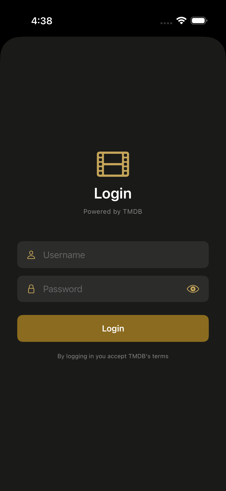
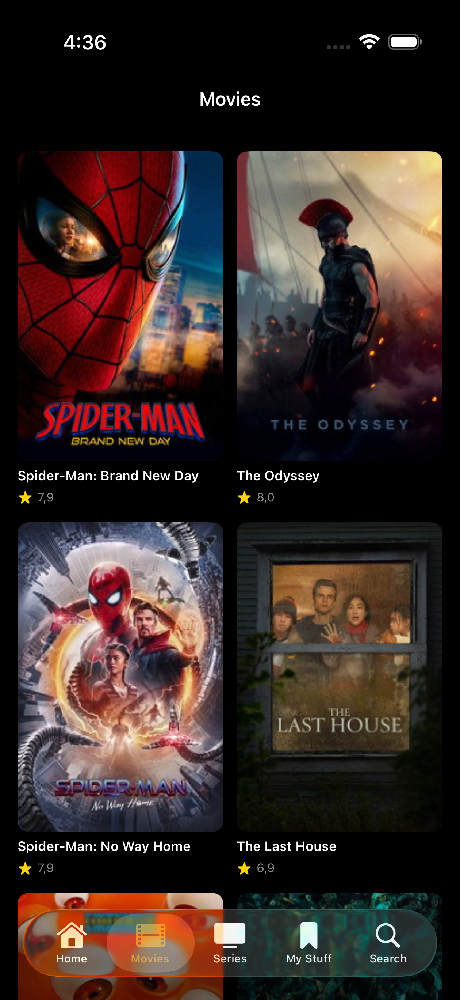
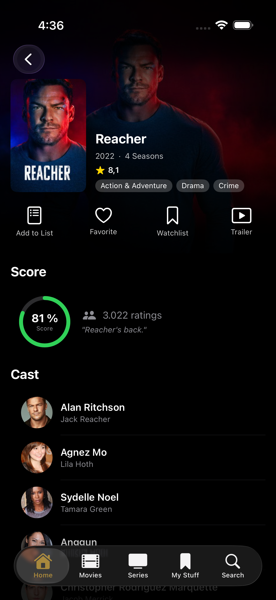
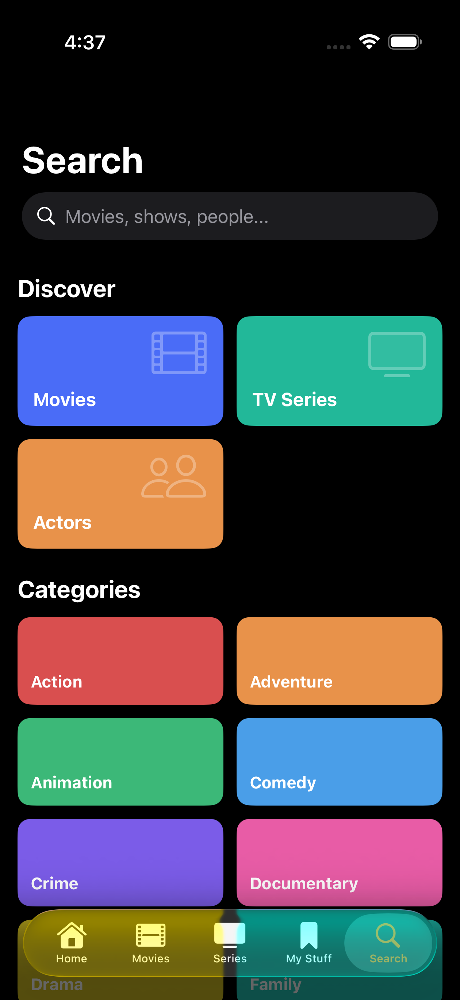
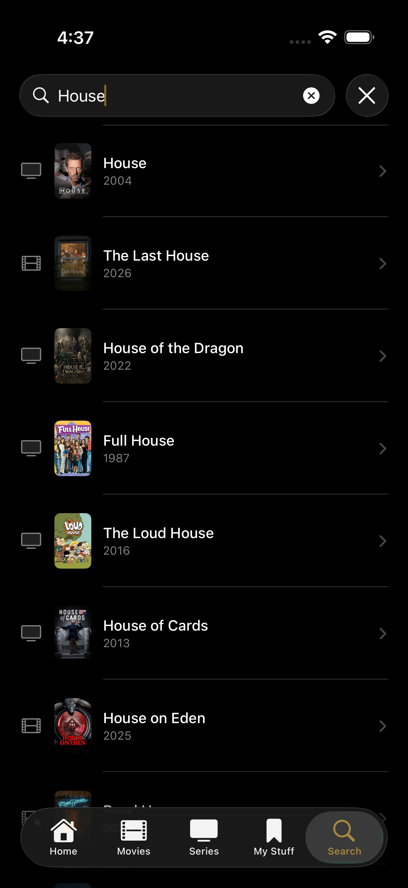
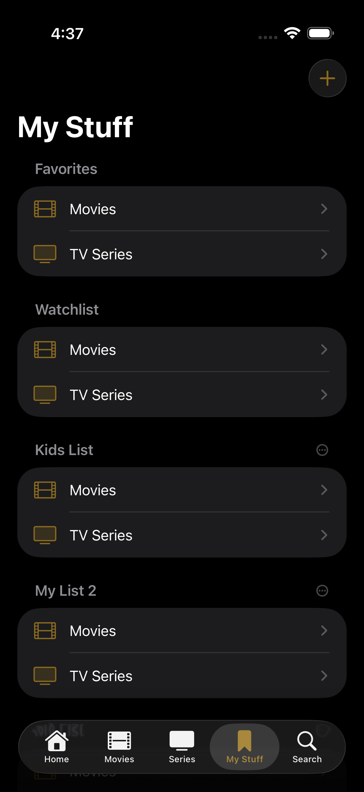
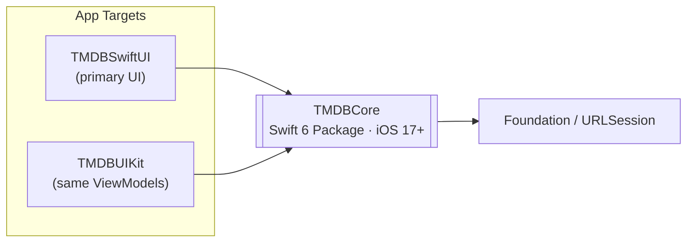
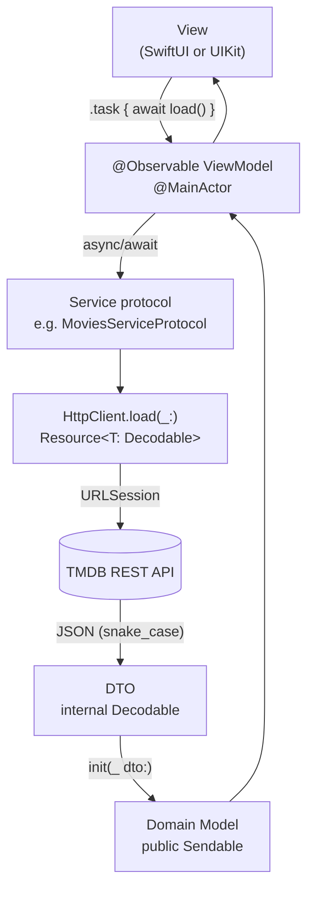
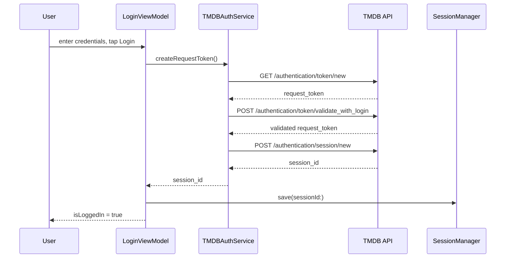
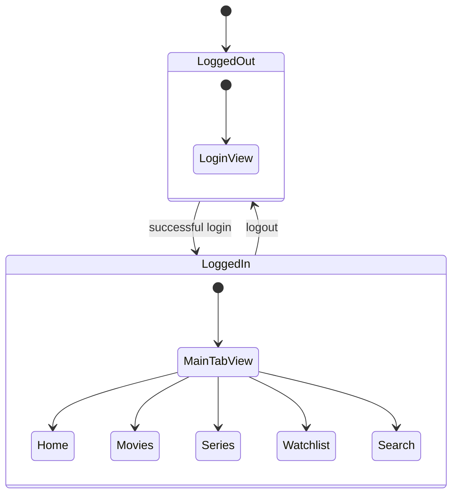

<div align="center">


# tmdb-app

**A TMDB client built twice — once in SwiftUI, once in UIKit — over one shared Swift 6 core.**


</div>

---

## Screenshots

| Login | Movies | Series Detail |
|:---:|:---:|:---:|
|  |  |  |

| Search · Discover | Search · Results | My Stuff |
|:---:|:---:|:---:|
|  |  |  |

## Overview

`tmdb-app` is a full-featured [TMDB](https://www.themoviedb.org/) client — browse popular movies and series, view detail pages with cast and reviews, log in with a real TMDB account, and manage a watchlist and favorites — shipped as **two separate app targets that share one business-logic package**. The same `TMDBCore` package, the same services, and the same `@Observable` ViewModels power a SwiftUI app and a UIKit app side by side. It exists as a deliberate demonstration of clean layering: swap the UI framework and nothing below the View layer has to change.

## Skills demonstrated

- **Dual-UI, shared-core architecture** — `TMDBSwiftUI` and `TMDBUIKit` are independent app targets, each with its own composition root, both consuming the exact same `TMDBCore` Swift Package.
- **Swift 6 strict concurrency** — `TMDBCore` builds under `swiftLanguageModes: [.v6]`; all shared protocols (`HttpClientProtocol`, service protocols, `SessionManagerProtocol`) are `Sendable`.
- **Observation, not Combine** — every ViewModel is `@MainActor @Observable`; UIKit consumes the same ViewModels via `withObservationTracking` render loops instead of duplicating state management per platform.
- **Protocol-oriented dependency injection** — ViewModels and services depend on protocol existentials (`any MoviesServiceProtocol`, `any SessionManagerProtocol`), injected from each target's composition root, never constructed internally.
- **Structured concurrency** — concurrent fetches with `async let` (movie detail + credits + reviews load in parallel; watchlist movies + TV shows load in parallel).
- **A real multi-step auth flow** — TMDB's three-call login sequence (request token → validate → create session) implemented with `async`/`await` and persisted through a protocol-backed session store.
- **Full test-double taxonomy** — the test suite doesn't just "use mocks"; it implements and documents all five classic test-double types (dummy, fake, stub, spy, mock) and picks the right one per test.
- **Localization done correctly** — `LocalizedStringKey` (not `String`) threaded through custom view parameters so nothing silently bypasses `Localizable.xcstrings` (English + `es-419`).
- **Zero third-party dependencies** — networking, DI, and persistence all built on Foundation/SwiftUI/UIKit/Observation alone.

## Architecture

### Module dependency graph

Two app targets, one core, no third-party packages.



### Request &amp; data flow

Every feature follows the same path from tap to pixel, regardless of which app target it runs in.



### TMDB login flow

The three sequential calls TMDB requires to exchange credentials for a session.



### App navigation

`AppRootView` (SwiftUI) and `SceneDelegate` (UIKit) both switch on the same `isLoggedIn` state.



## Tech stack

| Layer | Choice |
|---|---|
| Language | Swift 6 (strict concurrency, `Sendable` protocols) |
| UI | SwiftUI (primary) + UIKit (parity target), both driven by the same ViewModels |
| State | Observation framework (`@Observable`, `withObservationTracking`) — no Combine |
| Concurrency | `async`/`await`, `async let` for concurrent fan-out |
| Networking | Single generic `HttpClient.load(_:)` over `URLSession`, typed `Resource<T: Decodable>` |
| Testing | Swift Testing (`@Test`, `#expect`) with a full dummy/fake/stub/spy/mock test-double suite |
| Persistence | `SessionManager` for auth session; SwiftData folder present in `TMDBSwiftUI` |
| Localization | `Localizable.xcstrings` — English source, `es-419` translation |
| Dependencies | None — Foundation, SwiftUI, UIKit, Observation only |

## Project structure

```
tmdb-app/
├── TMDBCore/                    # Swift Package — all business logic, iOS 17+, Swift 6
│   ├── Sources/TMDBCore/
│   │   ├── Core/                 # HttpClient, SessionManager, Constants, TMDBConfig
│   │   ├── Login/                # 3-step TMDB auth
│   │   ├── Home/  Movies/  Series/  Detail/
│   │   ├── Search/  Watchlist/  Favorites/  MyStuff/  Profile/
│   └── Tests/TMDBCoreTests/      # Swift Testing suites + full test-double toolkit
├── TMDBSwiftUI/                  # Primary SwiftUI app target
│   ├── Composition/               # App entry, AppRootView, ViewModel factories
│   └── Home/ Login/ Movies/ Detail/ Profile/ Watchlist/ Search/ Series/
├── TMDBUIKit/                     # UIKit app target — same TMDBCore, same ViewModels
│   ├── Composition/               # SceneDelegate, tab bar, feature controllers
│   └── Home/ Login/ Movies/ Detail/ Profile/ Watchlist/ Search/ Series/
└── tmdb-app.xcodeproj/
```

## Testing

`TMDBCore/Tests/TMDBCoreTests/` uses the Swift Testing framework. Rather than reaching for one all-purpose "mock" everywhere, `TestDoubles.swift` implements and documents all five classic test-double kinds, and each test suite picks the one that matches what it's actually verifying:

| Type | Purpose | Example |
|---|---|---|
| **Dummy** | Passed to satisfy a signature, never invoked | `DummySessionManager` |
| **Fake** | Working shortcut implementation | `FakeSessionManager` (in-memory instead of Keychain) |
| **Stub** | Returns canned answers, no call tracking | `StubHttpClient`, `StubMoviesService`, `StubAuthService` |
| **Spy** | Stub that also records what was called | `SpySessionManager`, `SpyAuthService`, `SpyMoviesService` |
| **Mock** | Pre-programmed expectations; verifies call count/order | `MockAccountService`, `MockWatchlistService` |

Coverage spans the auth flow, movies/watchlist pagination, and ViewModel state transitions (loading, loaded, error, empty, re-entry guards) across Login, Home, Movies, Search, Watchlist, and Movie Detail.

```bash
# Xcode MCP tools (preferred)
RunAllTests

# or plain xcodebuild
xcodebuild -project tmdb-app.xcodeproj -scheme TMDBCore \
  -sdk iphonesimulator -destination 'platform=iOS Simulator,name=iPhone 17 Pro' test
```

## Getting started

1. Clone the repo.
2. Copy the config template and add your [TMDB API key](https://www.themoviedb.org/settings/api):
   ```bash
   cp TMDBSwiftUI/Config.xcconfig.example TMDBSwiftUI/Config.xcconfig
   # edit TMDBSwiftUI/Config.xcconfig and set TMDB_API_KEY
   ```
   (Do the same under `TMDBUIKit/` if you plan to run that target too.)
3. Open `tmdb-app.xcodeproj` in Xcode.
4. Pick the `TMDBSwiftUI` or `TMDBUIKit` scheme and run.

`Config.xcconfig` files are gitignored — never commit a real API key.

## License

MIT — see [LICENSE](LICENSE).

This product uses the TMDB API but is not endorsed or certified by TMDB.
